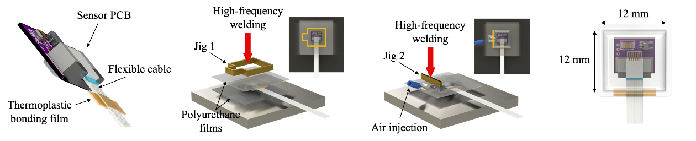
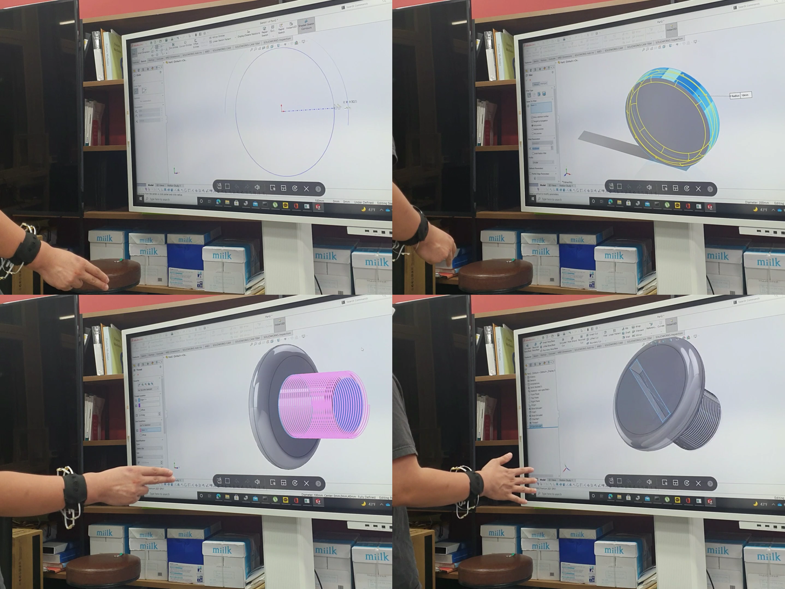

# TII_pMMG_HGR

## About Project
This repository contains project information related to **[High-Accuracy Hand Gesture Recognition on the Wrist Tendon Group Using Pneumatic Mechanomyography (pMMG)](https://ieeexplore.ieee.org/document/10136753)**, which is published in *[IEEE TRANSACTIONS ON INDUSTRIAL INFORMATICS](https://ieeexplore.ieee.org/xpl/RecentIssue.jsp?punumber=9424)*. This project underscores the pneumatic-observation of tendon forces to enable high-accuracy hand gesture recognition.

Our research primarily centers around leveraging pneumatic mechanomyography (pMMG) to attain precise gesture recognition. This methodology is an extension of our previous work, which initially proposed the concept of pMMG. Details regarding this prior research can be found in [the previous publication](https://ieeexplore.ieee.org/abstract/document/7045532).

This project outlines a novel fabrication method for pMMG sensors, which enabled simple and customizable sensor manufacturing. The entire research process utilized the pMMG wristband, a wireless gesture recognition device equipped with eight pMMG sensors.

This project is the first step of our robust wireless HGR controller for real-world applications. The real-world demo of the proposed wireless-device is shown in [this demo video](https://youtu.be/spRBrlzH1nE).

Future works will be devoted to develope user-independent classification model and enhance real-world robustness.